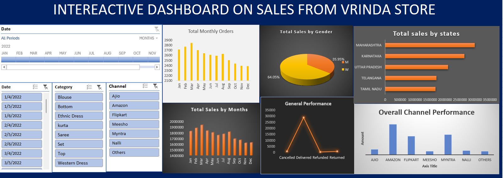

# Project 1

**Title:** [Sales Trend at Vrinda Store](https://github.com/olajideadebola168/olajideadebola168.github.io/blob/main/Excel%20Project.xlsx) 

**Tools Used:** Microsoft Excel (Pivot table, Pivot Charts, Pie Chart, Area line, Bar Charts, Slicers and Timelines)

**Project Description:** This project involved analysing product data of sales at Vrinda Store to identify trends and patterns in sales performance for 2022. It is designed to provide a comprehensive overview of key performance metrics. This dashboard allows stakeholders to easily monitor and analyze the company’s performance across different states, products, and time periods. The dashboard includes the following features:

Visual representation of profits broken down by each state.

A monthly breakdown of the total orders, providing insights into sales trends over time.

A monthly sale, allowing for easy comparison of profitability throughout the year.

Total Revenue by Gender which Highlights the total revenue generated by male and female sales representatives.

Additionally, the dashboard includes interactive slicers and timeline for:

Date: Filter the data to view performance for a specific date.

Category of products sold

Channel: Drill down into the performance of individual channels.

**Key findings:** 
1. State Profitability: Identified the most profitable states and highlighted regions where performance could be improved.

2. Best performing month: Revealed patterns in sales and profit in each month, allowing for more strategic planning.

3. Top-Performing Channels: Highlighted which channels are driving the most revenue and profit, aiding in inventory and marketing decisions.

4. Gender sales: Analyzed total sales by each gender to understand market dynamics and adjust business strategies accordingly.

**Dashboard Overview:** 

# Project 2

**Title:** Food_Supply_Table: Data Manipulation and Integration

**SQL Code:** [Food_Supply_Table SQL code](https://github.com/olajideadebola168/olajideadebola168.github.io/blob/main/Food_Supply_SQL)

**SQL Skills Used:** 
1. Data Retrieval (SELECT): Queried and extracted specific information from the database.
2. Data Aggregation (SUM, COUNT): Calculated totals, such as sales and quantities, and counted records to analyze data trends.
3. Data Filtering (WHERE, BETWEEN, IN, AND): Applied filters to select relevant data, including filtering by ranges and lists.
4. Data Source Specification (FROM): Specified the tables used as data sources for retrieval

**Project Description:**
This project involved analysing food supply data to identify trends and patterns in supply and sales made . It is designed to provide a comprehensive overview of key performance indicators.

**Technology used:** SQL server
